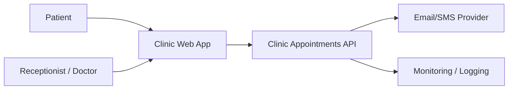
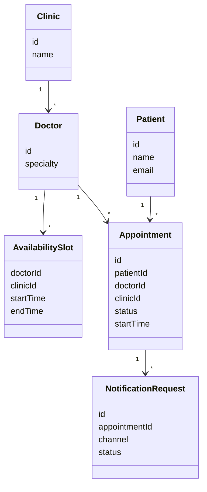
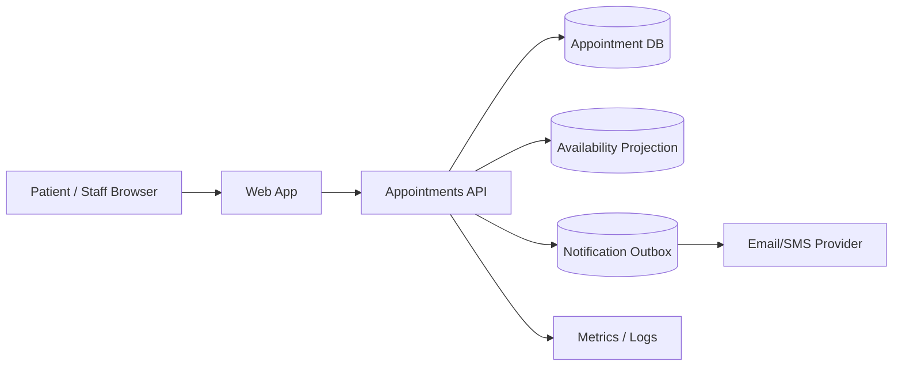
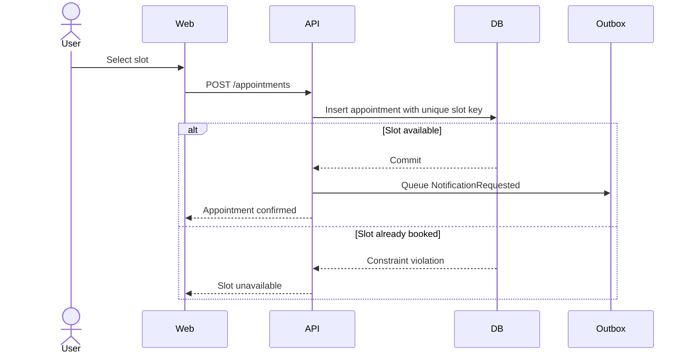

# Clinic Appointments - Architecture Document

## 1. Introduction

The Clinic Appointments system allows patients, receptionists and doctors to manage appointments across clinics. The initial architecture optimizes for MVP delivery, no double-booking, fast availability search and patient-data protection.

## 2. Context Diagram

## 3. Architectural Drivers

| Driver | Priority | Design response |
| --- | --- | --- |
| QA-1 Consistency | Primary | Transactional booking and unique slot constraint. |
| QA-2 Performance | Primary | Read-optimized availability projection. |
| QA-4 Security/privacy | Primary | API authorization and audit logging. |
| QA-3 Availability | Supporting | Simple cloud deployment and observable booking path. |
| QA-5 Monitorability | Supporting | Metrics/logging for booking and notifications. |
| QA-6 Modifiability | Supporting | Modular monolith boundaries. |

## 4. Domain Model

## 5. Container Diagram

## 6. Sequence Diagrams

### Book Appointment

## 7. Event Definitions

| Event | Producer | Consumer | Payload | Reliability |
| --- | --- | --- | --- | --- |
| AppointmentBooked | Appointments API | Availability projection | appointmentId, doctorId, clinicId, startTime | Transactional with booking. |
| NotificationRequested | Appointments API | Notification worker | appointmentId, channel, recipient | Stored in outbox and retried. |

## 8. Architectural Decisions

| ID | Driver | Decision | Rationale | Discarded alternatives | Consequences |
| --- | --- | --- | --- | --- | --- |
| ADR-001 | CON-2, QA-6 | Use a modular monolith. | Small team and short MVP timeline. | Microservices. | Module boundaries need code review. |
| ADR-002 | QA-1 | Use unique slot constraint in transactional booking. | Simplest reliable double-booking protection. | Distributed lock. | Slot key must be carefully defined. |
| ADR-003 | QA-2 | Use availability projection. | Fast search without overloading writes. | Raw table scans. | Projection freshness must be monitored. |
| ADR-004 | QA-4 | Enforce API authorization and audit logging. | Protects patient data at trust boundary. | UI-only authorization. | Requires role matrix and audit storage. |
| ADR-005 | QA-5 | Use notification outbox. | Provider failures do not break booking. | Synchronous provider call. | Requires retry and alerting. |

## 9. Interfaces

| Interface | Type | Purpose |
| --- | --- | --- |
| `GET /availability` | REST query | Search available appointment slots. |
| `POST /appointments` | REST command | Book appointment. |
| `PATCH /appointments/{id}` | REST command | Reschedule or cancel appointment. |
| `GET /doctor-schedule` | REST query | Show daily doctor schedule. |

## 10. Scrum Handoff

| Epic/Story | Driver or decision | Acceptance criteria | Architecture check |
| --- | --- | --- | --- |
| Book appointment | QA-1, ADR-002 | Same slot cannot be confirmed twice. | DB has unique slot key. |
| Search availability | QA-2, ADR-003 | P95 response under 1 second for expected load. | Query uses projection. |
| Secure patient access | QA-4, ADR-004 | Users cannot access other patient records. | API authorization tests pass. |
| Notification request | QA-5, ADR-005 | Booking succeeds when provider is down. | Request stored in outbox. |

## 11. Traceability Matrix

| Requirement | Scenario | Driver | Decision | View/diagram | Epic/Story | Check |
| --- | --- | --- | --- | --- | --- | --- |
| CA-3 | QA-1 | Consistency | ADR-002 | Book Appointment sequence | Book appointment | Unique slot key. |
| CA-2 | QA-2 | Performance | ADR-003 | Container | Search availability | Projection used. |
| CA-1 | QA-4 | Security/privacy | ADR-004 | Context/Container | Secure patient access | API auth tests. |
| CA-7 | QA-5 | Monitorability | ADR-005 | Event definitions | Notification request | Outbox retry/alerts. |

## 12. Governance Checks

- Critical stories link to at least one driver or decision.
- Booking code must use transactional unique slot constraint.
- Availability search must use projection, not raw scans.
- Patient data access must be authorized in the API.
- Notification provider calls must not run inside the booking transaction.
